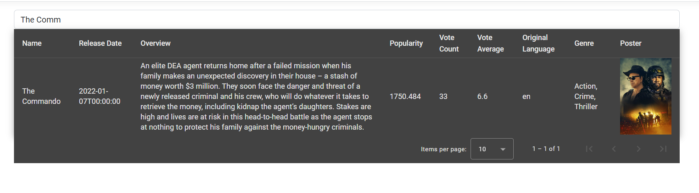

To set up this application you'll need to create an instance of the Database. Cosmos Db was used as the datastore, you can
set up a local instance of the emulator by following the link to download https://learn.microsoft.com/en-us/azure/cosmos-db/how-to-develop-emulator?tabs=windows%2Ccsharp&pivots=api-nosql#install-the-emulator.

Once downloaded run the emulator, and you'll see set up details. These details will already be in the application app config.


I took the CSV you sent and imported it using a small application I 
found on Github (https://github.com/AzureCosmosDB/data-migration-desktop-tool) this allowed me to import the CSV into my local cosmos db. To import the data the only 
configuration I needed to amend was in the migrationsettings.json, apart from this, nothing else needed to be changed. A minor adendum to this, make sure the properties are lowercase, rather than capitalised

Configuration used

```json
{
  "Source": "CSV",
  "Sink": "Cosmos-nosql",
  "SourceSettings": {
    "FilePath": "C:\\DataSample\\mymoviedb.csv"
  },
  "SinkSettings": {
    "ConnectionString": "AccountEndpoint=https://localhost:8081/;AccountKey=C2y6yDjf5/R+ob0N8A7Cgv30VRDJIWEHLM+4QDU5DE2nQ9nDuVTqobD4b8mGGyPMbIZnqyMsEcaGQy67XIw/Jw==",
    "Database": "movie-database",
    "Container": "movie-container",
    "PartitionKeyPath": "/title",
    "RecreateContainer": false,
    "IncludeMetadataFields": false
  }
}
```

Once run you should see the data from the CSV file in your local Cosmos


Now that everything is set, you should be able to run the application locally. It's a simple page which displays the movie list in a styled table. The table includes pagination
and a search box which allows you to filter down the list of movies as you type a title. The application works by sending a request via a CQRS query handler to access the cosmos 
db. The UI is using Angular, below is how the application should look


The filter bar allows you to filter by anything in the table, this isn't a server side search, it's a client side like the pagination. This could be an improvement to make, because 
then it'll mean the movie data will be loaded as it's required rather than all in one go on app start



Filter by genre

